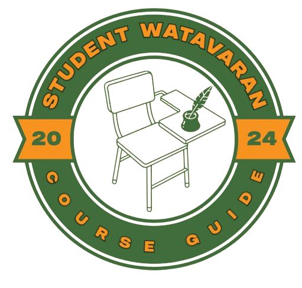
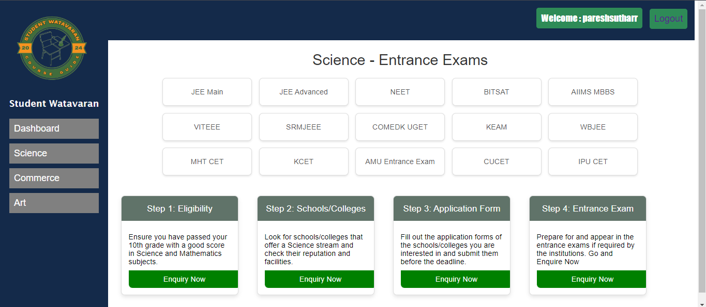

# Course Guide Selection Website



Welcome to the Course Guide Selection Website! This platform helps students who have completed their 12th grade in Science, Commerce, or Arts streams explore various courses and the entrance exams required to pursue them.

## Features

- Stream-based course recommendations
- Entrance exam details
- Detailed course information
- User-friendly interface



## Installation

1. **Clone the repository:**
    ```bash
    git clone https://github.com/yourusername/course-guide-selection.git
    cd course-guide-selection
    ```

The website will be available at `http://localhost:8000`.

## Course Streams

### Science
- Engineering: JEE, BITSAT, VITEEE
- Medical: NEET, AIIMS, JIPMER

### Commerce
- Business: IPMAT, NPAT, DU JAT
- Finance: CPT (CA), CS Foundation

### Arts
- Humanities: CUET, TISS BAT
- Fine Arts: NID DAT, UCEED
- Law: CLAT, AILET, LSAT

## License

This project is licensed under the MIT License. See the [LICENSE](LICENSE) file for details.

---

Visit our website: [Student Watavaran](http://www.studentwatawaran.com)
